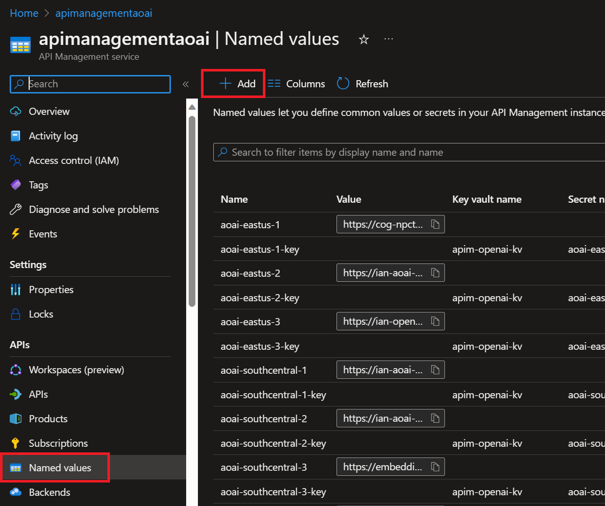

# Enterprise Azure OpenAI with Retry Logic

>**Note**: This repository builds off the [Enterprise Azure OpenAI Repository](https://github.com/Azure-Samples/openai-python-enterprise-logging) and adds in retry logic to handle 429 responses and manage traffic across multiple Azure OpenAI Endpoints.

>**ASSUMPTIONS FOR USAGE:** There are a few assumptions required to utilize this set-up and incorporate the retry logic as supplied. The first is that all models are deployed using the *model name* as the *deployment name*. For instance, the GPT-35-Turbo or ChatGPT model is deployed as "gpt-35-turbo", and not as "chat" or another customized name, across all your Azure OpenAI Resources. Second, the supplied XML and retry logic therein only attempts to handle for 429 responses from underlying Azure OpenAI API endpoints. The code as supplied covers 6 endpoints in East US and South Central regions but the logic can easily be expanded to use more regions and endpoints or fewer.

[XML Policy Script](./assets/apim_aoai_retry_06272023.xml)

[Excel File for Models per Region and Tokens Overview as of June 26, 2027](./assets/apim%20retry%20policy%20update%20june%2027%202023.xlsx)

Updated on 06/29/2023 to incorporate the [06/09/2023 Quota and Limit changes.](./assets/old_vs_new_quota.png)

Repository detailing the deployment of an Enterprise Azure OpenAI reference architecture.
<br/>Link: [Azure Architecture Center - Monitor OpenAI Models](https://learn.microsoft.com/en-us/azure/architecture/example-scenario/ai/log-monitor-azure-openai)

## Key Solution Advantages:
*	<b>Comprehensive logging of Azure OpenAI model execution tracked to Source IP address.</b>  Log information includes what text users are submitting to the model as well as text being received back from the model.  This ensures models are being used responsibly within the corporate environment and within the approved use cases of the service.
*	<b>Advanced Usage and Throttling controls</b> allow fine-grained access controls for different user groups without allowing access to underlying service keys.
*	<b>High availability of the model APIs</b> to ensure user requests are met even if the traffic exceeds the limits of a single Azure OpenAI service.
      * <b>Retry logic to handle 429 responses</b> and create a reliable user experience.
*	<b>Secure use of the service</b> by ensuring role-based access managed via Azure Active Directory follows principle of least privilege.


<div>
  <video controls src="https://user-images.githubusercontent.com/47987698/232847412-e0f5cdd1-a587-457f-9365-e3caa21c8ec9.mp4" muted="false"></video>
</div>

## Reference Architecture


<table style="border-collapse:collapse">
  <tr>
    <td style="border: none;vertical-align: top; font-size:.9em;">1. Client applications can access Azure OpenAI endpoints to perform text generation (completions) and model training (fine-tuning) endpoints to leverage the power of large language models.<br/>
    <br/>
    2. Next-Gen Firewall Appliance (Optional) - Provides deep packet level inspection for network traffic to the OpenAI Models.
    </td>
    <td style="border: none;vertical-align: top; font-size:.9em;">3. API Management Gateway enables security controls, auditing, and monitoring of the Azure OpenAI models.  Security access is granted via AAD Groups with subscription based access permissions in APIM.  Auditing is enabled via Azure Monitor request logging for all interactions with the models.  Monitoring enables detailed AOAI model usage KPIs/Metrics.</td>
    <td style="border: none;vertical-align: top; font-size:.9em;">4. API Management Gateway connects to all Azure resources via Private Link to ensure all traffic is secured by private endpoints and contained to private network.<br/><br/>5. Multiple Azure OpenAI instances enable scale out of API usage to ensure high-availability and disaster recovery for the service.</td>
  </tr>

</table>

## Features

This project framework provides the following features:

* Enterprise logging of OpenAI usage metrics:
   * Token Usage
   * Model Usage
   * Prompt Input
   * User statistics
   * Prompt Response
* High Availability of OpenAI service with region failover.
* Integration with latest OpenAI libraries-
  *  [OpenAI](https://github.com/openai/openai-python/) 
  *  [LangChain](https://python.langchain.com/en/latest/)
  *  [Llama-index](https://gpt-index.readthedocs.io/en/latest/)

## Getting Started

### Prerequisites
- [Azure Subscription](https://azure.microsoft.com/en-us/get-started/)
- [Azure OpenAI Application](https://aka.ms/oai/access) 
  
### Installation
Provisioning artifacts, begin by provisioning the solution artifacts listed below:

-	[Azure OpenAI Cognitive Service]( https://azure.microsoft.com/en-us/products/cognitive-services/openai-service/)
-	[Azure API Management](https://azure.microsoft.com/services/api-management/)
-	[Azure Monitor](https://azure.microsoft.com/services/monitor/)

(Optional)
- Next-Gen Firewall Appliance
-	[Azure Application Gateway](https://azure.microsoft.com/services/application-gateway/)
-	[Azure Virtual Network](https://azure.microsoft.com/services/virtual-network/)

### Managed Services
-	[Azure Key Vault](https://azure.microsoft.com/services/key-vault/)
-	[Azure Storage](https://azure.microsoft.com/services/storage/)
-	[Azure Active Directory](https://azure.microsoft.com/services/active-directory/)

## Configuration

### Azure OpenAI
- To begin, provision a resource for Azure OpenAI in your preferred region.  <b>Please note the current primary region is East US</b>, new models and capacity will be provisioned in this location before others: [Provision resource](https://portal.azure.com/?microsoft_azure_marketplace_ItemHideKey=microsoft_openai_tip#create/Microsoft.CognitiveServicesOpenAI)

- Once the resource is provisioned, create a deployment with model of choice: [Deploy Model](https://learn.microsoft.com/en-us/azure/cognitive-services/openai/how-to/create-resource?pivots=web-portal#deploy-a-model)

- After the model has been deployed, go to the OpenAI studio to test your newly created model with the studio playground: [oai.azure.com/portal](oai.azure.com/portal)


### API Management Config

- API Management can be provisioned through Azure Portal :[Provision resource](https://learn.microsoft.com/en-us/azure/api-management/get-started-create-service-instance) 
- Once the API Management service has been provisioned you can import your OpenAI API layer using the OpenAPI specification for the service.
  - [Import instructions](https://learn.microsoft.com/en-us/azure/api-management/import-and-publish#go-to-your-api-management-instance)
  - Open the APIM - API blade and Select the Import option for an existing API.  
  
  - Select the Update option to update the API to the current OpenAI specifications.
    - Completions OpenAPI -  https://raw.githubusercontent.com/Azure/azure-rest-api-specs/main/specification/cognitiveservices/data-plane/AzureOpenAI/inference/stable/2023-05-15/inference.json
  
  - (Optional) For Semantic Kernel compatibility "Append" the following Authoring API endpoints:
    - Authoring OpenAPI - https://raw.githubusercontent.com/Azure/azure-rest-api-specs/c183bb012de8e9e1d0d2e67a0994748df4747d2c/specification/cognitiveservices/data-plane/AzureOpenAI/authoring/stable/2022-12-01/azureopenai.json 
- <b>For All API Operations</b>:
  - In <b>Settings</b> set the Subscription - <b>header name</b> to "api-key" to match OpenAI library specifications.
  
  - Configure the Diagnostic Logs settings:
    - Set the sampling rate to 100%
    - Set the "Number of payload bytes to log" as the maximum.
  
- In the **left-hand blade menu** under the **APIs** heading, locate the **Named values** menu and add your endpoints and keys:
<div style="text-align: center;">
    
</div>

  - Ensure that you add **"/openai"** to the end of each Azure OpenAI Endpoint as below:
  
  

  - You may add the keys as either secrets in API-M or with a Key Vault.

> **NOTE:** To utilize the included XML script as-is, you will need to create named-value pairs for all the end-points and secrets (6 in total in the example). Note that the endpoints are named "aoai-eastus-1" and matched with "aoai-eastus-1-key" etc. These create the variables that we are then able to call in-line in our retry policy logic. These can be named in any manner or pattern desired as long as those same named pairs are properly replaced in the retry block.

- Next we will need to define the policies for our API operations.
    
    - Navigate to the **APIs** Blade on the left-hand side:
      
    
    - Then navigate into your **API**, make sure you're in **All operations** and select any of the "**</>**" icons:
      
    
    - Copy-paste in the code within this [API-M XML Script](./assets/apim_aoai_retry_06062023.xml) assuming you named 6 endpoints as shown above. Otherwise, you will need to edit the script to utilize the **Named values** you supplied in the step above.
      > **Note:** This Azure API Management Service policy block is an XML code that defines a set of policies to be applied to incoming and outgoing API requests. The primary function of this policy block is to handle inbound requests, route them to different backend services based on a generated random number, and manage the retry mechanism in case of rate-limiting (HTTP 429 status code) responses from the backend services.

    - Click **Save** - if you have correctly supplied the endpoint and key variable names it will save and you can test. 

**IMPORANT NOTES REGARDING THE XML SCRIPT:** 

---  

  The retry policy in the provided XML is used to automatically retry the request to the backend service under certain conditions. 
  In this specific case, the policy is set to retry the request when the following conditions are met:
  The response status code is 429 (Too Many Requests): 
  This usually indicates that the client has sent too many requests in a given amount of time, and the server is rate-limiting the requests.

  count: This attribute specifies the maximum number of retries that the policy will attempt if the specified condition is met. 
  For example, if count="5", the policy will retry up to 5 times.

  interval: This attribute specifies the time interval (in seconds) between each retry attempt. 
  If interval="1", there will be a 1-second delay between retries.

  first-fast-retry: This attribute, when set to true, allows the first retry attempt to happen immediately, without waiting for 
  the specified interval. If set to false, all retry attempts will wait for the interval duration before being executed.

  When the retry policy is triggered, it will execute the logic inside the <choose> block to modify the backend service URL and API key based 
  on the value of the urlId variable. This effectively changes the backend service to which the request will be retried, 
  in case the initial backend service returns a 429 status code.

  This will likely get improved / updated but hey, it works. May the 4th be with you.

  05/5/23 Previous attempt borked after 3 retries... now with moar retries:
  Back-end service now gets incremented by 1 after each sub-sequent retry. 
  Count is set to 45 and interval is at 4 seconds, this is for the GPT-4 model which has an RPM=18.
  So with these settings, the first retry should happen immediately and in a new region, with each subsequent retry
  cycling between regions with a 4 second interval between them. The 45 retries means this should take roughly 3 minutes before it
  finally quits retrying, but no individual resource should be hit more than 15 times in a single minute.
  There are different blocks for the different "sets" of models. One for the GPT-4 models, another for text-davinci-002 or text-davinci-003, and a third for all models that do not match those names. These blocks can be reconfigured to group models and endpoints as desired.

  **PLEASE NOTE THAT WHEN YOU CHANGE THE NUMBER OF ENDPOINTS BEING USED FROM 6 !!!**

  You  need to edit line 29 to choose a random number with 1 inclusive, top-level exclusive i.e. Next(1, 7) chooses 1, 2, 3, 4, 5, or 6. So if you want to use 9 endpoints that would be Next(1, 10) etc.
  You must then also adjust each point where the ("urlId") % 6 + 1) logic is used e.g. if we have 9 endpoints that would be ("urlId") % 9 + 1). You will get 500 errors otherwise as it will try to set a new urldId variable to a potentially non-existent endpoint number or fail to use all available endpoints.

---

- Test API
  - Test the endpoint by providing the "deployment-id", "api-version" and a sample prompt:
    

  
#### (Optional) Subscription Access Control
API Management allows API providers to protect their APIs from abuse and create value for different API product tiers. Use of  API Management layer to throttle incoming requests is a key role of Azure API Management. Either by controlling the rate of requests or the total requests/data transferred.
<br/>Details for configuring APIM Layer : https://learn.microsoft.com/en-us/azure/api-management/api-management-sample-flexible-throttling

### Logging OpenAI completions
- Once the API Management layer has been configured, you can configure existing OpenAI python code to use the API layer by adding the subscription key parameter to the completion request:
Example:
```python
import openai

openai.api_type = "azure"
openai.api_base = "https://xxxxxxxxx.azure-api.net/" # APIM Endpoint
openai.api_version = "2023-05-15"
openai.api_key = "APIM SUBSCRIPTION KEY" #DO NOT USE ACTUAL AZURE OPENAI SERVICE KEY


response = openai.Completion.create(engine="modelname",  
                                    prompt="prompt text", temperature=1,  
                                    max_tokens=200,  top_p=0.5,  
                                    frequency_penalty=0,  
                                    presence_penalty=0,  
                                    stop=None) 

```

</code>

## Demo

- Once OpenAI requests begin to log to the Azure Monitor service, you can begin to analyze the service usage using Log Analytics queries.
  - [Log Analytics Tutorial](https://learn.microsoft.com/en-us/azure/azure-monitor/logs/log-analytics-tutorial)
- The table should be named <b>"ApiManagementGatewayLogs"</b>
- The <b>BackendResponseBody</b> field contains the json response from the OpenAI service which includes the text completion as well as the token and model information.
- Example query to identify token usage by ip and model:
```kusto
ApiManagementGatewayLogs
| where OperationId == 'completions_create'
| extend modelkey = substring(parse_json(BackendResponseBody)['model'], 0, indexof(parse_json(BackendResponseBody)['model'], '-', 0, -1, 2))
| extend model = tostring(parse_json(BackendResponseBody)['model'])
| extend prompttokens = parse_json(parse_json(BackendResponseBody)['usage'])['prompt_tokens']
| extend completiontokens = parse_json(parse_json(BackendResponseBody)['usage'])['completion_tokens']
| extend totaltokens = parse_json(parse_json(BackendResponseBody)['usage'])['total_tokens']
| extend ip = CallerIpAddress
| where model !=  ''
| summarize
    sum(todecimal(prompttokens)),
    sum(todecimal(completiontokens)),
    sum(todecimal(totaltokens)),
    avg(todecimal(totaltokens))
    by ip, model
```

- Example query to monitor prompt completions: 
```kusto
ApiManagementGatewayLogs
| where OperationId == 'completions_create'
| extend model = tostring(parse_json(BackendResponseBody)['model'])
| extend prompttokens = parse_json(parse_json(BackendResponseBody)['usage'])['prompt_tokens']
| extend prompttext = substring(parse_json(parse_json(BackendResponseBody)['choices'])[0], 0, 100)
```


## Resources
- Azure API Management Policies for Azure OpenAI: https://github.com/mattfeltonma/azure-openai-apim

