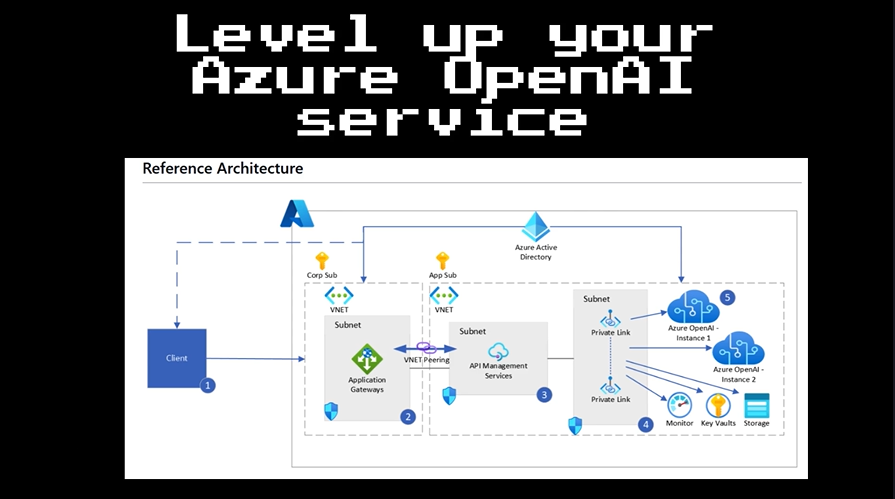
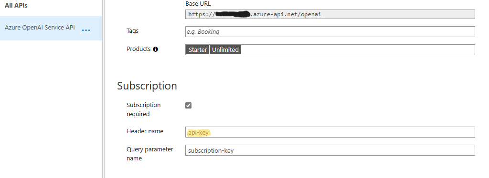

# Enterprise Azure OpenAI

Repository detailing the deployment of an Enterprise Azure OpenAI reference architecture. 

## Key Solution Advantages:
*	<b>Comprehensive logging of Azure OpenAI model execution tracked to Source IP address.</b>  Log information includes what text users are submitting to the model as well as text being received back from the model.  This ensures models are being used responsibly within the corporate environment and within the approved use cases of the service.
*	<b>Advanced Usage and Throttling controls</b> allow fine-grained access controls for different user groups without allowing access to underlying service keys.
*	<b>High availability of the model APIs</b> to ensure user requests are met even if the traffic exceeds the limits of a single Azure OpenAI service.
*	<b>Secure use of the service</b> by ensuring role-based access managed via Azure Active Directory follows principle of least privilege.

[](https://clipchamp.com/watch/WX92A7nDyR4 'link')

## Reference Architecture


## Features

This project framework provides the following features:

* Enterprise logging of OpenAI usage metrics:
   * Token Usage
   * Model Usage
   * Prompt Input
   * User statistics
   * Prompt Response
* High Availability of OpenAI service with region failover.
* Integration with latest OpenAI libraries-
  *  [OpenAI](https://github.com/openai/openai-python/) 
  *  [LangChain](https://python.langchain.com/en/latest/)
  *  [Llama-index](https://gpt-index.readthedocs.io/en/latest/)

## Getting Started

### Prerequisites
- [Azure Subscription](https://azure.microsoft.com/en-us/get-started/)
- [Azure OpenAI Application](https://aka.ms/oai/access) 
- 
### Installation
Provisioning artifacts, begin by provisioning the solution artifacts listed below:

-	[Azure OpenAI Cognitive Service]( https://azure.microsoft.com/en-us/products/cognitive-services/openai-service/)
-	[Azure API Management](https://azure.microsoft.com/services/api-management/)
-	[Azure Monitor](https://azure.microsoft.com/services/monitor/)

(Optional)
-	[Azure Application Gateway](https://azure.microsoft.com/services/application-gateway/)
-	[Azure Virtual Network](https://azure.microsoft.com/services/virtual-network/)

### Managed Services
-	[Azure Key Vault](https://azure.microsoft.com/services/key-vault/)
-	[Azure Storage](https://azure.microsoft.com/services/storage/)
-	[Azure Active Directory](https://azure.microsoft.com/services/active-directory/)

## Configuration

### Azure OpenAI
- To begin, provision a resource for Azure OpenAI in your preferred region.  <b>Please note the current primary region is East US</b>, new models and capacity will be provisioned in this location before others: [Provision resource](https://portal.azure.com/?microsoft_azure_marketplace_ItemHideKey=microsoft_openai_tip#create/Microsoft.CognitiveServicesOpenAI)

- Once the resource is provisioned, create a deployment with model of choice: [Deploy Model](https://learn.microsoft.com/en-us/azure/cognitive-services/openai/how-to/create-resource?pivots=web-portal#deploy-a-model)

- After the model has been deployed, go to the OpenAI studio to test your newly created model with the studio playground: [oai.azure.com/portal](oai.azure.com/portal)


### API Management Config

- API Management can be provisioned through Azure Portal :[Provision resource](https://learn.microsoft.com/en-us/azure/api-management/get-started-create-service-instance) 
- Once the API Management service has been provisioned you can import your OpenAI API layer using the OpenAPI specification for the service.
  - [Import instructions](https://learn.microsoft.com/en-us/azure/api-management/import-and-publish#go-to-your-api-management-instance)
  - Open the APIM - API blade and Select the Import option for an existing API.  
  
  - Select the Update option to update the API to the current OpenAI specifications.
    - Completions OpenAPI -  https://raw.githubusercontent.com/Azure/azure-rest-api-specs/main/specification/cognitiveservices/data-plane/AzureOpenAI/inference/preview/2023-03-15-preview/inference.json
  
- <b>For All API Operations</b>:
  - In <b>Settings</b> set the Subscription - <b>header name</b> to "api-key" to match OpenAI library specifications.
  
  -  Configure the inbound rule of "set-headers" to add/override the "api-key" header parameter with a value of the API secret key from the OpenAI service.  Instructions for locating your OpenAI keys are here: [Retrieve keys](https://learn.microsoft.com/en-us/azure/cognitive-services/openai/quickstart?pivots=programming-language-python#retrieve-key-and-endpoint)
  
  - Configure the backend service to the endpoint of your deployed OpenAI service with /openai as the path, be sure to override the existing endpoint: 
    - Example: <b>https://< yourservicename >.openai.azure.com<i>/openai</i></b>
    - [Retrieve endpoint](https://learn.microsoft.com/en-us/azure/cognitive-services/openai/quickstart?pivots=programming-language-python#retrieve-key-and-endpoint)
  
  - Configure the Diagnostic Logs settings:
    - Set the sampling rate to 100%
    - Set the "Number of payload bytes to log" as the maximum.
  

- Test API
  - Test the endpoint by providing the "deployment-id", "api-version" and a sample prompt:
    

  
#### (Optional) Subscription Access Control
API Management allows API providers to protect their APIs from abuse and create value for different API product tiers. Use of  API Management layer to throttle incoming requests is a key role of Azure API Management. Either by controlling the rate of requests or the total requests/data transferred.
<br/>Details for configuring APIM Layer : https://learn.microsoft.com/en-us/azure/api-management/api-management-sample-flexible-throttling

### Logging OpenAI completions
- Once the API Management layer has been configured, you can configure existing OpenAI python code to use the API layer by adding the subscription key parameter to the completion request:
Example:
```python
import openai

openai.api_type = "azure"
openai.api_base = "https://xxxxxxxxx.azure-api.net/" # APIM Endpoint
openai.api_version = "2023-03-15-preview"
openai.api_key = "APIM SUBSCRIPTION KEY" #DO NOT USE ACTUAL AZURE OPENAI SERVICE KEY


response = openai.Completion.create(engine="modelname",  
                                    prompt="prompt text", temperature=1,  
                                    max_tokens=200,  top_p=0.5,  
                                    frequency_penalty=0,  
                                    presence_penalty=0,  
                                    stop=None) 

```

</code>

## Demo

- Once OpenAI requests begin to log to the Azure Monitor service, you can begin to analyze the service usage using Log Analytics queries.
  - [Log Analytics Tutorial](https://learn.microsoft.com/en-us/azure/azure-monitor/logs/log-analytics-tutorial)
- The table should be named <b>"ApiManagementGatewayLogs"</b>
- The <b>BackendResponseBody</b> field contains the json response from the OpenAI service which includes the text completion as well as the token and model information.
- Example query to identify token usage by ip and model:
```kusto
ApiManagementGatewayLogs
| where OperationId == 'completions_create'
| extend modelkey = substring(parse_json(BackendResponseBody)['model'], 0, indexof(parse_json(BackendResponseBody)['model'], '-', 0, -1, 2))
| extend model = tostring(parse_json(BackendResponseBody)['model'])
| extend prompttokens = parse_json(parse_json(BackendResponseBody)['usage'])['prompt_tokens']
| extend completiontokens = parse_json(parse_json(BackendResponseBody)['usage'])['completion_tokens']
| extend totaltokens = parse_json(parse_json(BackendResponseBody)['usage'])['total_tokens']
| extend ip = CallerIpAddress
| where model !=  ''
| summarize
    sum(todecimal(prompttokens)),
    sum(todecimal(completiontokens)),
    sum(todecimal(totaltokens)),
    avg(todecimal(totaltokens))
    by ip, model
```

- Example query to monitor prompt completions: 
```kusto
ApiManagementGatewayLogs
| where OperationId == 'completions_create'
| extend model = tostring(parse_json(BackendResponseBody)['model'])
| extend prompttokens = parse_json(parse_json(BackendResponseBody)['usage'])['prompt_tokens']
| extend prompttext = substring(parse_json(parse_json(BackendResponseBody)['choices'])[0], 0, 100)
```


## Resources


